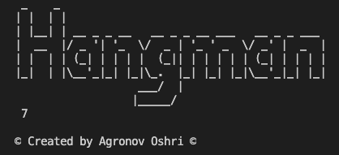

# HangMan Game - Project written in python
[](https://www.python.org/)[](https://svgshare.com/i/Zhy.svg)[](https://svgshare.com/i/ZjP.svg)[](https://svgshare.com/i/ZhY.svg)
> The project is a simple "Hangman" game, i created that as part of my course i took in python :smile:.
## Table of contents
* [General info](#general-info)
* [Technologies](#technologies)
* [Features](#features)
* [Screenshots](#screenshots)
* [Setup](#setup)
* [Project Status](#project-status)
* [Acknowledgements](#acknowledgements)
* [Contact](#contact)

## General info
- The game is simple you need to guess the word, letter by letter until you got the full word.
- You have 7 tries but you can change the number of tries in the code, that up to you.
	
## Technologies
Project is created with:
* python version: 3.9 .
* visual studio code.
* os - Library used to create a shortcut to the path of the file "word" , where all the words to guess are.
* time - Library used to create delay between renders so the user could manage to see the results.

## Features
- You can add more words to guess, by adding them to "word.text" file!
- The number of guesses are changeable by change the number in "MAX_TRIES" variable

## Screenshots

- The number at bottom left is the number of tries you have.

## Setup
1. To run this project, you need just to install python
2. Make sure to get the correct path to the word.text! (The structure go like this: ~/"the folder you put the file"/words.txt).
3. Run the script through the cmd/terminal, because the game is display in console promote.

Example of the script run:
```
$ cd ../"The folder where the HangManGame file is located"
$ python HangManGame.py
$ Enter the destenation to check: ~/Documents/words.txt
$ Please enter an index: 5
$ Lets Start!
  _  _  _  _  _  _  _ 

 Enter the guessed letter: 
```

## Project Status
The project is completed but no longer get updated, because it was part of a course i took, and i moved on to other courses to expand my knowledge ⚡.
i hope you enjoy my work 😄.

## Acknowledgements
I would want to thank CampusIL and the team behind the Self.py course!
> Link to the course home page [here](https://campus.gov.il/course/course-v1-cs-gov_cs_selfpy101/)

## Contact
Created by Oshri Agronov, feel free to contact me :v:
