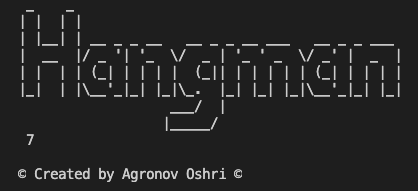

# Project HangMan (Game) - written in python
[](https://www.python.org/)[](https://svgshare.com/i/Zhy.svg)[](https://svgshare.com/i/ZjP.svg)[](https://svgshare.com/i/ZhY.svg)
## Table of contents
* [General info](#general-info)
* [Technologies](#technologies)
* [Features](#features)
* [Screenshots](#screenshots)
* [Setup](#setup)
* [Contact](#contact)

## General info
- This project is simple "Hangman" game, i created that as part of my course i toke in python :).
- In this game you need to guess the word, letter by letter until you got the full word.
- you have 7 tries but you can change thr number of tries in the code, that up to you.
	
## Technologies
Project is created with:
* python version: 3.9 .
* visual studio code.
* os - Library used to create a shortcut to the path of the file "word" , where all the words to guess are.
* time - Library used to create delay between renders so the user could manage to see the results.

## Features
- You can add more words to guess, by adding them to "word.text" file!
- The number of guesses are changeable by change the number in "MAX_TRIES" variable

## Screenshots


## Setup
To run this project, you need just to install python and run it through the cmd/terminal, because the game is display in console promote.
Make sure to put the correct path to the word.text! (The structre go like this: ~/Documents/words.txt).
example of run code:
```
$ cd ../"The folder where the HangManGame file is located"
$ python HangManGame.py
```
## Contact
Created by Oshri Agronov, feel free to contact me!
